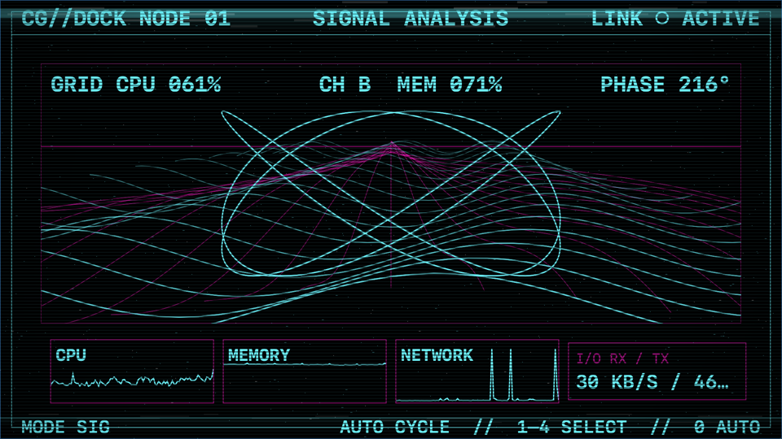
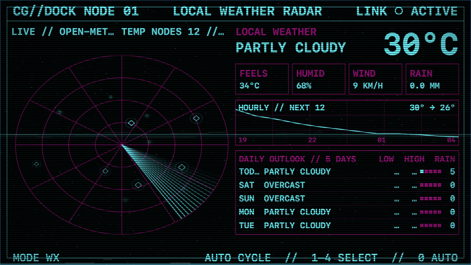
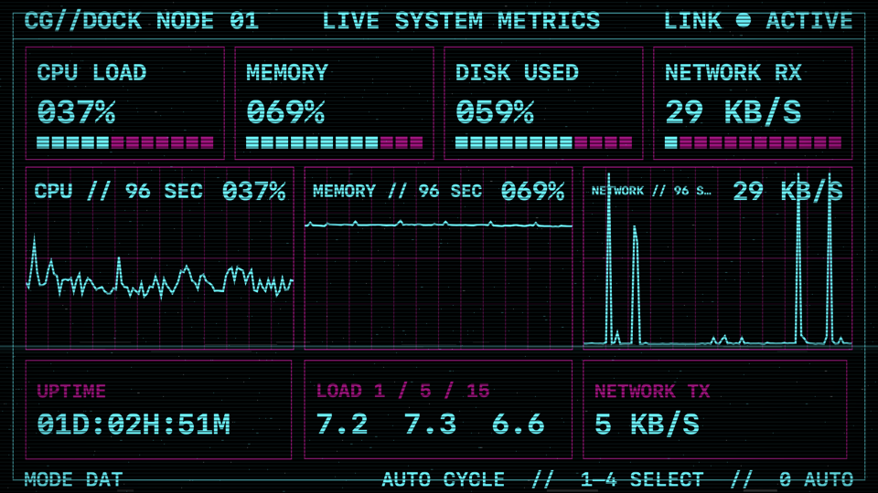

# Retrolemetry

Retrolemetry turns a secondary Mac display into a native, animated system console. Its composition is designed at 960×540, then scales proportionally to Mac, iPad/Sidecar, phone-landscape, and custom display sizes without distorting the layout. It stays out of the Dock and uses SwiftUI and AppKit—no Electron or web view.







## Features

### Live console

- CPU, memory, disk, network, load average, and uptime telemetry
- Four views: System Telemetry, Sector Scan, Signal Analysis, and Live System Metrics
- A dedicated live stock-market screen with a rotating globe, separate world clocks, two five-symbol ticker boards, a click-to-cycle Today/Week/Month/Year focus chart, and a compact USD→ILS reference-rate history
- Green-phosphor and synthwave themes, plus adjustable bloom, scan bands, noise, vignette, and dual VHS tracking lines
- Local conditions, a 12-hour temperature/precipitation forecast, a configurable 3–7-day outlook, and click-to-cycle weather radar targets

### Dedicated-display behavior

- Borderless output with Match Display, common Mac/iPad/phone-landscape presets, and custom dimensions
- Automatically chooses the smallest external display, or remembers a display selected in Settings
- Returns to that display after reconnection
- Waits hidden when an explicitly selected display is disconnected instead of falling back to the main Mac display
- Can cover the menu bar on the dock display without changing the main display

### Customization and control

- Optional automatic scene cycling, configurable scene order and interval, horizontal mouse-wheel navigation, and selectable Pan, Diagonal Wipe, or Sync Roll transitions
- Keys `1`–`4` select a scene; `0` or `A` resumes automatic cycling
- Visual layout editor with drag, resize, visibility, three typography roles, and per-view reset controls
- Radar aspect-ratio calibration for unusual physical screens
- Editable Finnhub watch symbols with a Keychain-protected personal API key
- Three configurable market-panel world clocks with automatic daylight-saving changes
- Optional animated synthwave perspective grid in Signal Analysis, with selectable patterns and CPU, system-load, network, or disk response
- Settings export, menu-bar controls, Launch at Login, a `SIGUSR1` automation toggle, and one-gesture horizontal scene navigation that ignores momentum reversals

GPU utilization and temperatures are intentionally omitted because macOS does not provide stable public APIs suitable for this lightweight implementation.

## Requirements

- macOS 14 Sonoma or later
- Any macOS-visible secondary display. Match Display is recommended; iPad works through Sidecar, while an iPhone requires third-party software that exposes it to macOS as an external display.
- Apple silicon or Intel, depending on the architecture included in the downloaded release

## Install from GitHub Releases

1. Download the latest `Retrolemetry-*.zip` from [GitHub Releases](https://github.com/SamSpring/Retrolemetry/releases).
2. Unzip it and move `Retrolemetry.app` to `/Applications`.
3. Open Retrolemetry. Grant location access only if you want local weather.
4. Use the waveform icon in the menu bar to choose the dock display and adjust Settings.

The release page should state whether a build is signed and notarized. A locally built or unsigned archive may trigger additional macOS security prompts; the repository does not claim notarization until a release has actually completed Apple's notarization service.

## Build from source

Open `Package.swift` in Xcode and run the `Retrolemetry` executable, or use Terminal:

```sh
swift run Retrolemetry
```

To produce a standard app bundle and zip in `build/` and `dist/`:

```sh
./scripts/package_app.sh
```

Use Xcode or Command Line Tools whose Swift compiler and macOS SDK versions match. The packaging script applies an ad-hoc signature unless `CODESIGN_IDENTITY` is set to a Developer ID Application identity.

## Controls and automation

- `1`–`4`: select a scene
- `0` or `A`: resume automatic cycling
- Horizontal mouse wheel: move between scenes
- Menu-bar waveform: show/hide, toggle synthwave colors, move display, open Settings, or quit
- `⌘⇧D` toggles the console and `⌘⇧S` toggles synthwave while Retrolemetry is active
- `⌘⇧D`: show or hide while the menu is active

For BetterTouchTool, add a **Run Shell Script / Task** action:

```sh
killall -USR1 Retrolemetry
```

The signal hides the console to reveal the content underneath, or restores it to the preferred display. The process remains running, so the response is immediate.

To bind synthwave switching in BetterTouchTool, use a second **Run Shell Script / Task** action:

```sh
killall -USR2 Retrolemetry
```

## Display setup and Launch at Login

Retrolemetry starts as a menu-bar accessory app and centers its fixed-size window on the selected display. If no display is selected, it chooses the smallest connected external display. You can turn off menu-bar covering or change the target in Settings.

**Launch Retrolemetry at login** uses Apple's `SMAppService.mainApp`. It is intended for an installed `.app` bundle in `/Applications`; it is not available when running the raw Swift Package executable from Terminal.

## Privacy and weather

Retrolemetry has no accounts, analytics, advertising, or bundled tracking SDKs. System telemetry is read and displayed locally.

Weather is optional. When location access is allowed, Core Location provides an approximate coordinate and Retrolemetry sends that coordinate to the [Open-Meteo](https://open-meteo.com/) forecast API over HTTPS. The app does not include a weather API key and does not store a location history. Denying location access leaves the weather panel unavailable without affecting system telemetry.

Live market data is also optional. Retrolemetry sends only the configured ticker symbols directly to Finnhub and stores the user's personal Finnhub API key in macOS Keychain. The key is never written to preferences, exported settings, source control, or release archives. Focus-chart requests send only the selected ticker symbol to Yahoo's public, no-login chart endpoint; Retrolemetry never connects to a Yahoo account or portfolio. The USD→ILS panel requests public daily reference-rate history from [Frankfurter](https://frankfurter.dev/) and is explicitly labeled as daily data, not a live trading quote. Quotes are informational and are not trading advice.

## Support

If Retrolemetry is useful to you, you can [support future development on Ko-fi](https://ko-fi.com/samspring).

Bug reports and focused feature requests are welcome in [GitHub Issues](https://github.com/SamSpring/Retrolemetry/issues).

## Development

Small, behavior-preserving fixes are welcome. See [CONTRIBUTING.md](CONTRIBUTING.md). Maintainers can find signing, notarization, and release packaging steps in [RELEASING.md](RELEASING.md).

Retrolemetry is available under the [MIT License](LICENSE).
